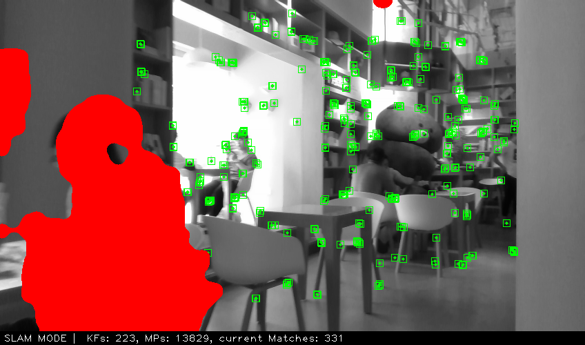
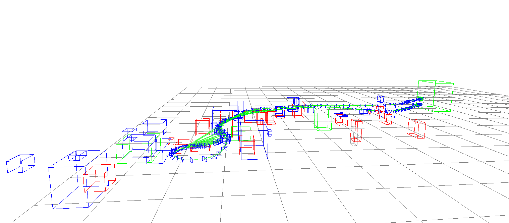
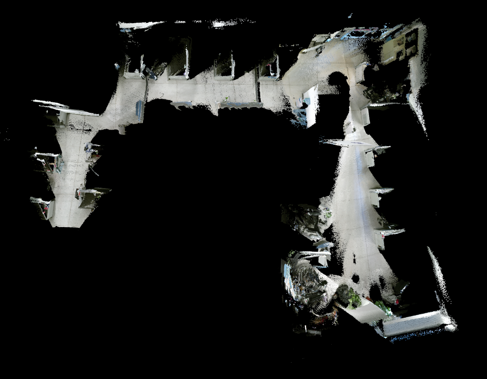
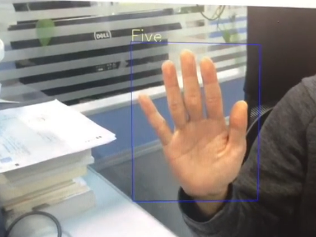

<!--
 * @Author: 王培荣
 * @Date: 2019-12-31 15:21:52
 * @LastEditTime : 2020-01-04 11:12:48
 * @LastEditors  : Please set LastEditors
 * @Description: In User Settings Edit
 * @FilePath: /catkin_ws/src/orbslam_semantic_nav_ros/README.md
 -->
# orbslam_semantic_nav_ros

---
演示1：

[](https://www.bilibili.com/video/av81958116)

---

演示2：
[](https://www.bilibili.com/video/av81398597)

---

# 安装说明

版本要求：

Linux:ubuntu16 
ros:kinect

### 1. 添加Vocabulary
在ros包的下新建Vocabulary文件夹，添加ORBvoc.txt词典。
```
mkdir Vocabulary
add ORBvoc.txt
```

### 2. 安装腾讯ncnn库
```
cd Thirdparty/ncnn
mkdir build&&cd build
cmake ..
make
sudo make install
sudo cp Thirdparty/ncnn/build/install/lib/libncnn.a /usr/lib
```

### 3 其他库
vtk 5
pcl 1.7
opencv 3.4
Eigen
pangolin
octomap

### 4 安装科大讯飞语音相关库
- step1 在科大讯飞注册账户，修改speech/src中appid参数
- step2 安装相关库
```
sudo apt-get install libasound2-dev #asound库
sudo apt-get install mplayer #mplayer工具
```
- step3 在科大讯飞官网下载SDK，在fileroot/libs/x64中将libmsc.so文件复制到/usr/local/lib中


### 5 安装百度aip相关库
```
sudo apt-get install ros-kinetic-image-view
sudo apt-get install libjsoncpp-dev
sudo apt-get install openssl
sudo apt-get install curl
```

修改aip-cpp/src中的appid,AK,SK

### 6 开始编译
```
catkin_make
```

### 7 修改config文件夹下的setting.yaml文件和相机的yaml文件

[配置文件说明](config/README.md)

修改rospackage_path，设置为自己对应存储的路径。

修改color_img_topic和depth_img_topic

# 动态环境的ORBSLAM



# 语义地图

```
roslaunch slam_semantic_nav_ros ORB_Semantic_Navigation.launch
```



# 三维重构


# 语音对话
```
roslaunch slam_semantic_nav_ros gesture_speak.launch 
```

# 手势识别

 

```
roslaunch slam_semantic_nav_ros gesture_speak.launch
```

