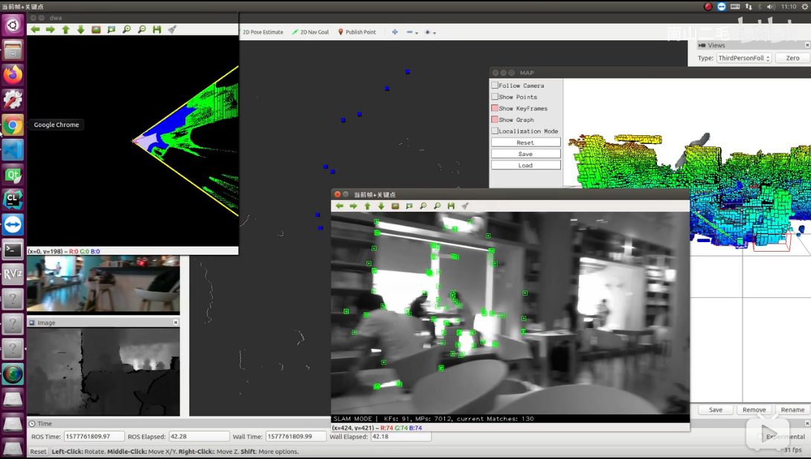
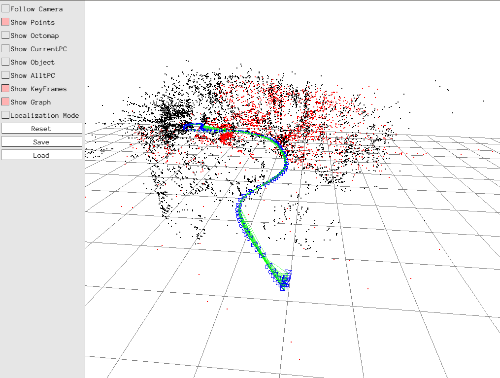
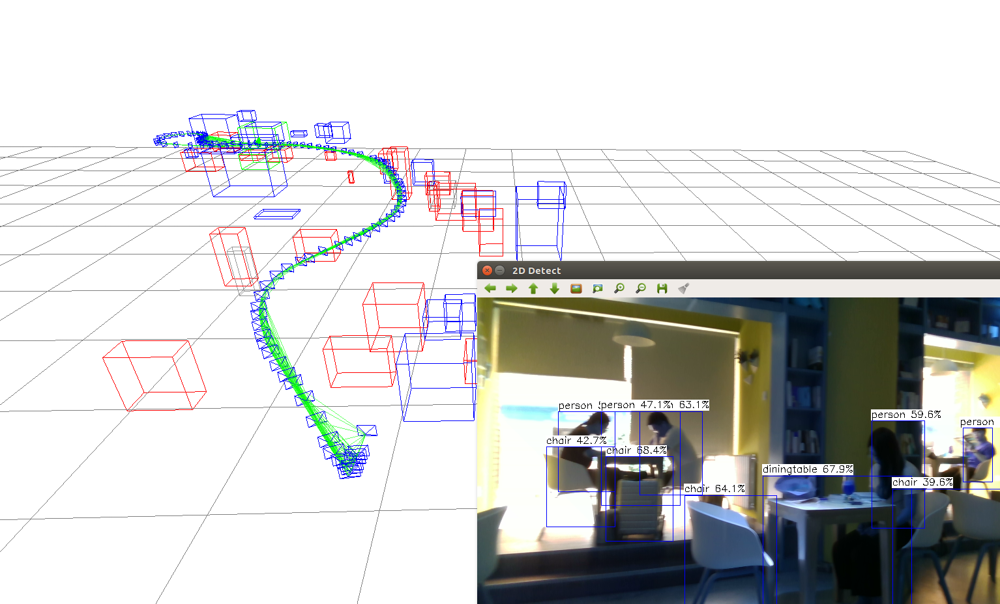
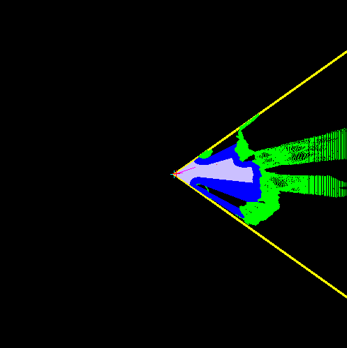

<!--
 * @Author: 王培荣
 * @Date: 2019-12-31 15:21:52
 * @LastEditTime : 2020-01-15 19:16:43
 * @LastEditors  : Please set LastEditors
 * @Description: In User Settings Edit
 * @FilePath: /catkin_ws/src/orbslam_semantic_nav_ros/README.md
 -->
# orbslam_semantic_nav_ros

> 清华大学 深圳国际研究生院 
> > 先进制造学部 精密测控组 

Have Done:

1. 动态物体检测
  
2. 视觉建图与定位

3. 重定位

4. 稠密点云、面元三维重建

5. 语义地图

6. 手势识别控制

7. 语音唤醒与识别控制

8. 局部避障与DWA控制

9. 语音识别与播放


TODO：
    
1. 添加基于二维码的全局定位误差矫正功能，该功能可以提高系统稳定性，确保项目落地

2. 多个相机slam，增强系统鲁棒性

3. 二维投影地图构建，全局路径规划，智能导航与交互

4. 基于强化学习的自主探索系统

5. 待定

---
演示1：

[](https://www.bilibili.com/video/av81958116)

---

演示2：

[](https://www.bilibili.com/video/av81398597)

---

# 安装说明

系统版本要求：

- Linux:ubuntu16

- ros:kinect

已测试硬件：

- KinectV2相机

- realsense D435,D400相机

### (1) 添加Vocabulary

在ros包的下新建Vocabulary文件夹，添加ORBvoc.txt词典。

```
mkdir Vocabulary
add ORBvoc.txt
```

### (2) 安装腾讯ncnn库

```
cd Thirdparty/ncnn
mkdir build&&cd build
cmake ..
make
sudo make install
sudo cp Thirdparty/ncnn/build/install/lib/libncnn.a /usr/lib
```

### (3) 其他库

vtk 5

pcl 1.7

opencv 3.4

Eigen

[pangolin](https://github.com/stevenlovegrove/Pangolin)

octomap

### (4) 安装科大讯飞语音相关库
- step1 在科大讯飞注册账户，修改setting_file.yaml中的appid参数
- step2 安装相关库
```
sudo apt-get install libasound2-dev #asound库
sudo apt-get install mplayer #mplayer工具
```
- step3 在科大讯飞官网下载SDK，在fileroot/libs/x64中将libmsc.so文件复制到/usr/local/lib中


### (5) 安装百度aip相关库
```
sudo apt-get install ros-kinetic-image-view
sudo apt-get install libjsoncpp-dev
sudo apt-get install openssl
sudo apt-get install curl
```

修改setting_file.yaml中的中的百度appid,AK,SK

### (6) 开始下载源码进行编译
```
mkdir -p catkin_ws/src
git clone git@github.com:MRwangmaomao/semantic_slam_nav_ros.git
cd ..
catkin_make
```

### (7) 修改config文件夹下的setting.yaml文件和对应的相机的配置文件、DWA配置文件

[配置文件说明](config/README.md)

修改所有的rospackage_path参数，设置为自己对应存储的路径。

修改color_img_topic和depth_img_topic

### (8) 相关公开数据集下载

[OpenLORIS-Scene Dataset](https://lifelong-robotic-vision.github.io/dataset/scene)

# 动态环境的ORBSLAM
 




# 语义地图

```
roslaunch slam_semantic_nav_ros ORB_Semantic_Nav.launch
```





# 三维重构


# 代价地图与导航


# 语音对话
```
roslaunch slam_semantic_nav_ros gesture_speak.launch 
```

# 手势识别

 

Five手势: 空闲状态，可以由其他节点发送/cmd_vel速度指令进行控制

Ok手势: 前进，只受手势控制，需要手势解锁

Fist手势: 停止状态，只受手势控制，需要手势解锁

```
roslaunch slam_semantic_nav_ros gesture_speak.launch
```

# 参考

[ORBSLAM](https://github.com/raulmur/ORB_SLAM2)

[ORB_SLAM2_SSD_Semantic](https://github.com/Ewenwan/ORB_SLAM2_SSD_Semantic)

[百度AI开放平台](https://ai.baidu.com/)

[科大讯飞语音](https://www.xfyun.cn/)
